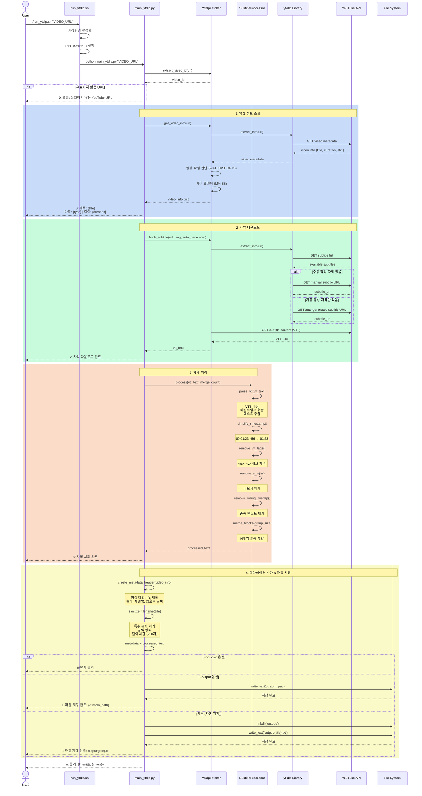
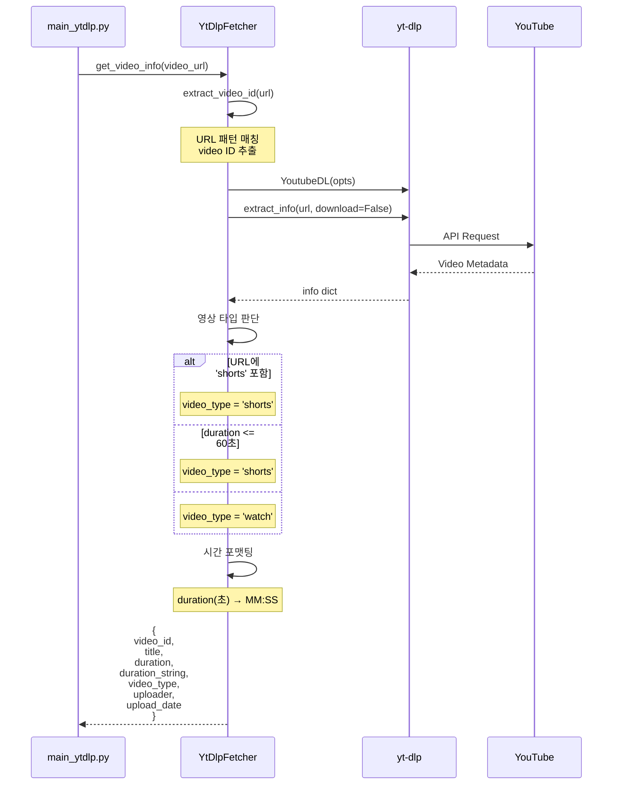
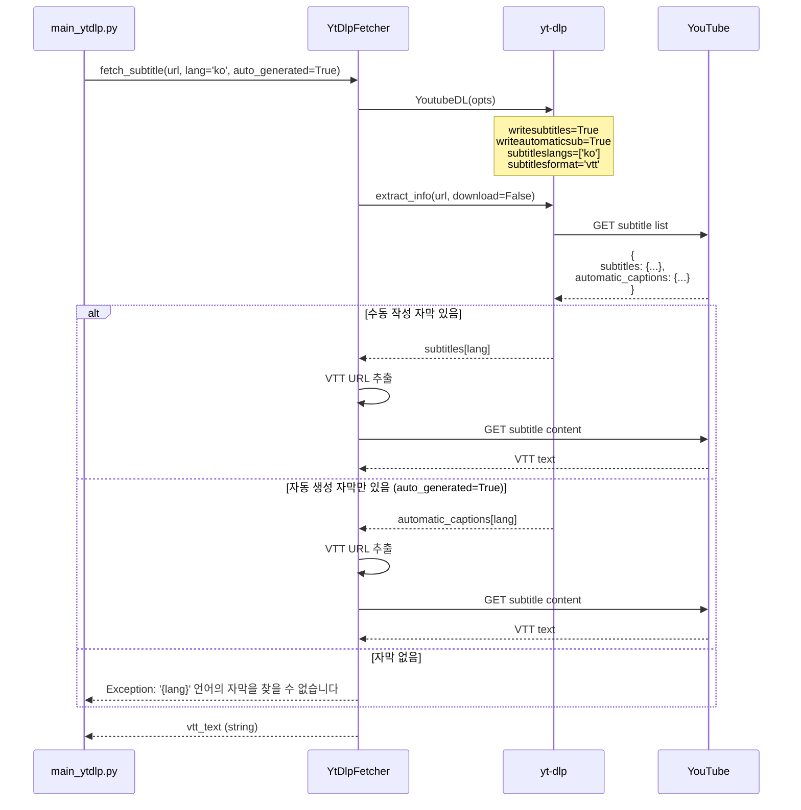
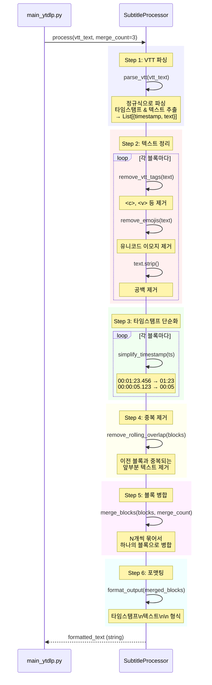
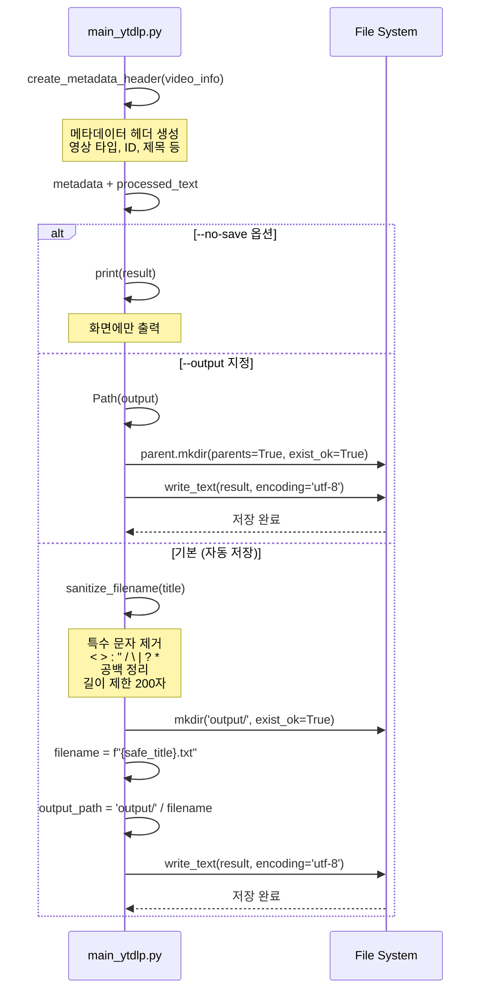
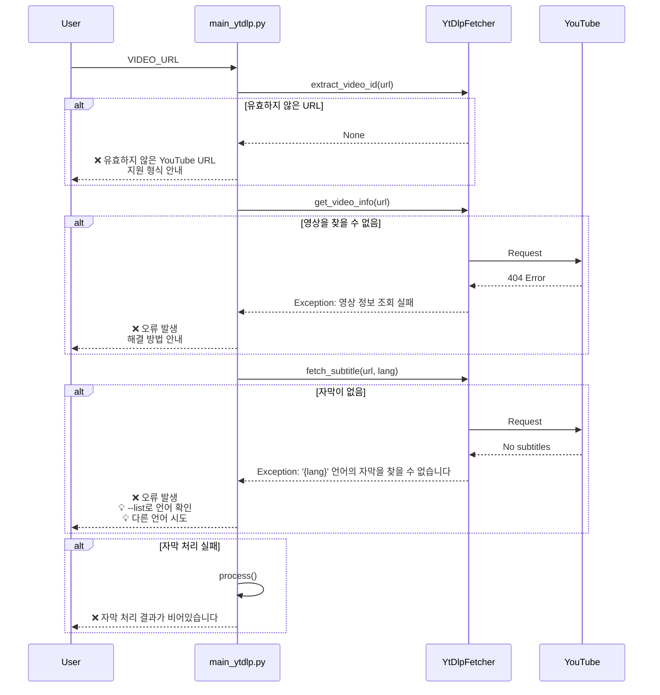
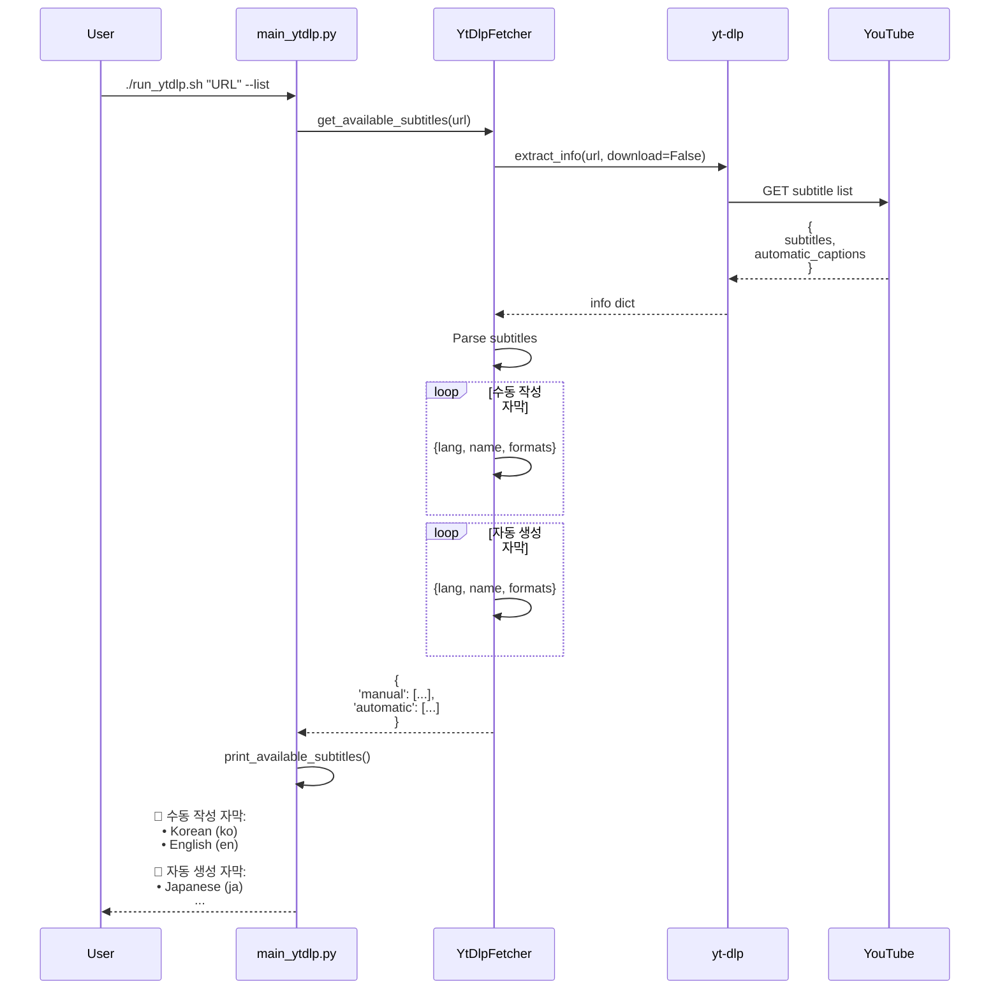

# YouTube 자막 추출 시퀀스 다이어그램

## 전체 프로세스 (yt-dlp 버전)



---

## 영상 정보 조회 상세



---

## 자막 다운로드 상세



---

## 자막 처리 파이프라인



---

## 파일 저장 프로세스



---

## 에러 처리 플로우



---

## --list 옵션 플로우



---

## 주요 컴포넌트 역할

### 1. run_ytdlp.sh

- 가상환경 활성화
- PYTHONPATH 설정
- main_ytdlp.py 실행

### 2. main_ytdlp.py

- CLI 인터페이스
- 옵션 파싱
- 전체 프로세스 조율
- 메타데이터 헤더 생성
- 파일명 생성 및 저장

### 3. YtDlpFetcher

- Video ID 추출
- 영상 정보 조회
- 자막 다운로드
- 영상 타입 판단

### 4. SubtitleProcessor

- VTT 파싱
- 텍스트 정리
- 중복 제거
- 블록 병합
- 포맷팅

### 5. yt-dlp Library

- YouTube API 통신
- 메타데이터 추출
- 자막 URL 제공

---

## 데이터 플로우

```
YouTube URL
    ↓
Video ID 추출
    ↓
영상 정보 조회 → {title, duration, type, ...}
    ↓
자막 다운로드 → VTT text
    ↓
VTT 파싱 → [{timestamp, text}, ...]
    ↓
텍스트 정리 → 태그/이모지 제거
    ↓
중복 제거 → 롤링 오버랩 제거
    ↓
블록 병합 → N개씩 묶기
    ↓
메타데이터 추가 → 헤더 + 자막
    ↓
파일 저장 → output/{title}.txt
```
